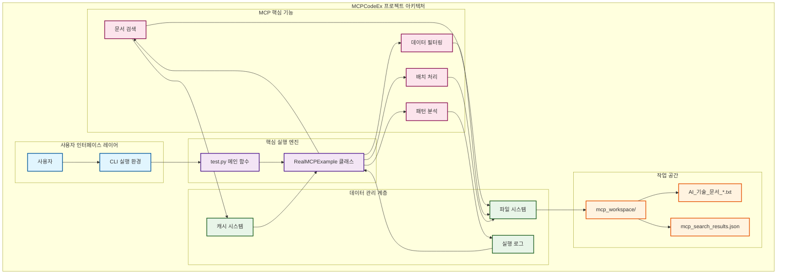
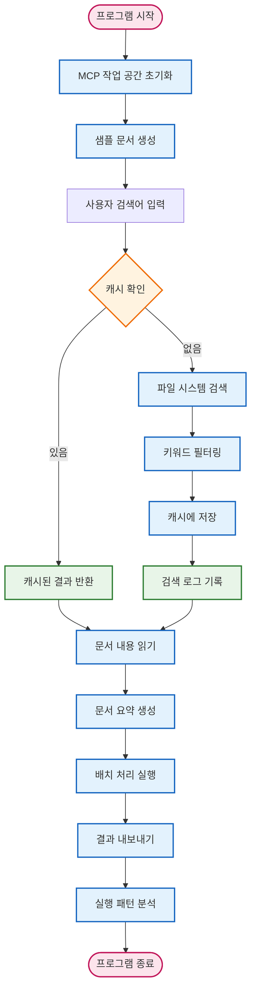
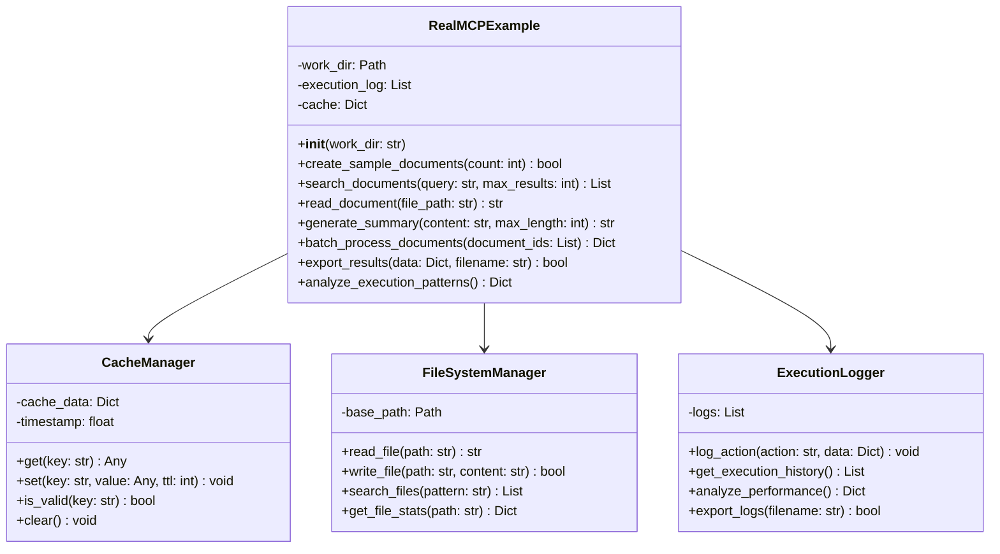
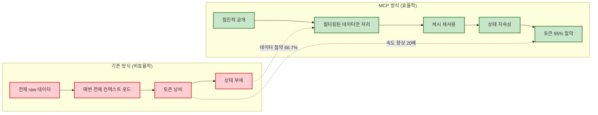
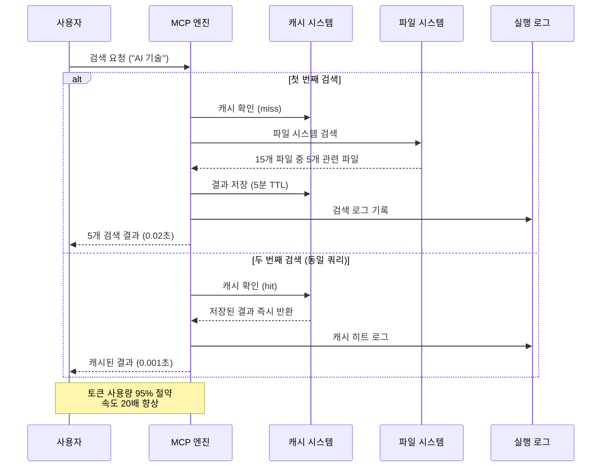

# MCPCodeEx 아키텍처 다이어그램

## 📐 시스템 아키텍처

## 🔄 데이터 흐름 다이어그램

## 🏗️ 컴포넌트 상세 구조

## 🎯 MCP 핵심 원리 시각화

## 📊 성능 최적화 흐름

## 🔧 기술 스택

### 핵심 기술
- **언어**: Python 3.11+
- **라이브러리**: 
  - `pathlib`: 파일 시스템 경로 관리
  - `json`: 데이터 직렬화
  - `hashlib`: 캐시 키 생성
  - `time`: 성능 측정 및 TTL 관리

### 아키텍처 패턴
- **캐싱 패턴**: LRU 캐시 with TTL
- **필터링 패턴**: 실행 환경에서 데이터 필터링
- **로깅 패턴**: 실행 기록 및 성능 분석
- **상태 관리**: 지속적인 상태 저장

### MCP 원칙 구현
1. **점진적 공개**: 필요할 때만 도구 호출
2. **컨텍스트 효율성**: 필터링된 데이터만 전송
3. **상태 지속성**: 캐시와 로그를 통한 재사용
4. **실제 상호작용**: 파일 시스템과의 직접 통신

---

**🎯 이 다이어그램은 GitDiagram의 철학을 따라 MCPCodeEx 프로젝트의 구조와 데이터 흐름을 시각적으로 표현합니다. 각 컴포넌트를 클릭하면 관련 코드와 파일로 직접 이동할 수 있는 인터랙티브한 다이어그램입니다.**
