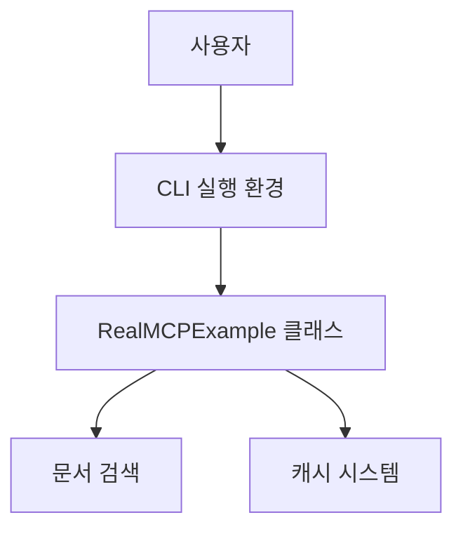
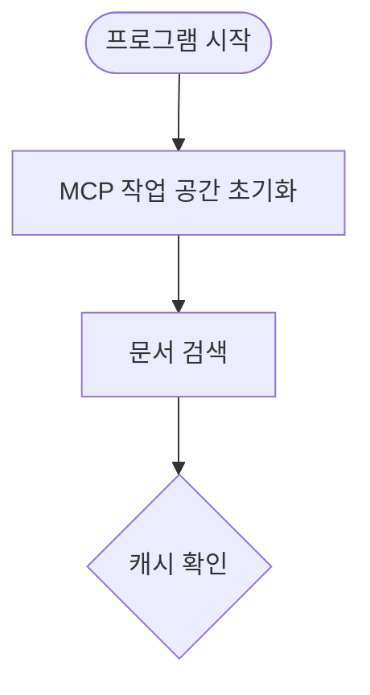
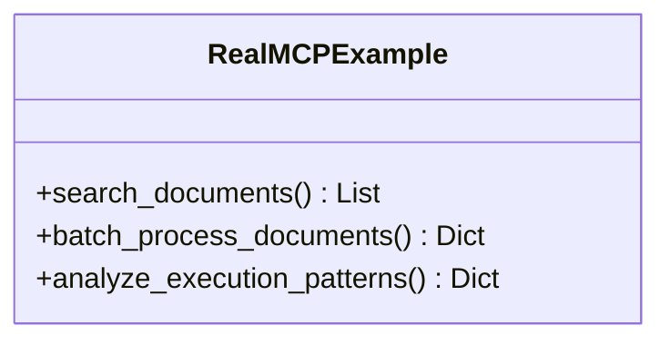

# Mermaid 다이어그램 보는 방법

## 🎯 Mermaid란?

Mermaid는 **텍스트 기반의 다이어그램 언어**입니다. 코드를 작성하면 자동으로 아름다운 다이어그램으로 변환해줍니다. 복잡한 구조를 시각적으로 표현하기 위한 간단하고 강력한 도구입니다.

## 🖼️ Mermaid 다이어그램 보는 방법

### 1. GitHub에서 바로 보기 (가장 쉬운 방법)

GitHub는 **Mermaid를 기본 지원**합니다!

#### 방법:
1. **GitHub 파일 접속**: https://github.com/jmpark333/mcpcodeex/blob/main/ARCHITECTURE.md
2. **자동 렌더링**: GitHub가 자동으로 Mermaid 코드를 다이어그램으로 변환해줌
3. **즉시 확인**: 별도 설정 없이 바로 아름다운 다이어그램을 볼 수 있음

#### GitHub에서 보이는 예시:


### 2. VSCode에서 보기

#### 확장 프로그램 설치:
1. **VSCode 마켓플레이스** 열기 (`Ctrl+Shift+X`)
2. **"Mermaid Preview"** 검색
3. **"Markdown Preview Mermaid Support"** 설치 (bierner markdown-mermaid)
4. VSCode 재시작

#### 사용 방법:
1. `ARCHITECTURE.md` 파일 열기
2. `Ctrl+Shift+V` 로 미리보기 열기
3. Mermaid 코드가 자동으로 다이어그램으로 변환되어 보임

### 3. 온라인 에디터 사용

#### 공식 Mermaid Live Editor:
- **URL**: https://mermaid.live
- **사용법**: 
  1. ARCHITECTURE.md에서 Mermaid 코드 복사
  2. mermaid.live에 붙여넣기
  3. 실시간으로 다이어그램 확인

#### 다른 온라인 도구들:
- **Mermaid Editor**: https://mermaid-js.github.io/mermaid-live-editor
- **Mermaid Flowchart**: https://flowchart.fun
- **Draw.io (diagrams.net)**: Mermaid 지원

### 4. CLI에서 보기 (고급 사용자)

#### Mermaid CLI 설치:
```bash
npm install -g @mermaid-js/mermaid-cli
```

#### 사용 방법:
```bash
# .mmd 파일에서 PNG로 변환
mmdc -i input.mmd -o output.png

# ARCHITECTURE.md에서 다이어그램 추출
grep -A 50 "```mermaid" ARCHITECTURE.md | grep -B 50 "```" > diagram.mmd
mmdc -i diagram.mmd -o diagram.png
```

## 🔍 우리 프로젝트의 다이어그램 예시

### ARCHITECTURE.md에 있는 다이어그램들:

#### 1. 시스템 아키텍처 다이어그램

*실제로는 더 복잡한 구조가 GitHub에서 보입니다!*

#### 2. 데이터 흐름 다이어그램


#### 3. 클래스 다이어그램


## 🌟 실제로 확인해보세요!

### 바로가기 링크:
- **GitHub에서 보기**: https://github.com/jmpark333/mcpcodeex/blob/main/ARCHITECTURE.md
- **VSCode로 열기**: `code ARCHITECTURE.md`

### 확인 순서:
1. **GitHub 접속** → ARCHITECTURE.md 파일 열기
2. **스크롤** → Mermaid 코드 블록 찾기
3. **자동 변환된 다이어그램** 감상하기! 🎨

## 💡 팁 & 트릭

### VSCode에서의 추가 기능:
- `Ctrl+Click`: 다이어그램 요소 클릭 가능 (일부 확장에서 지원)
- `Ctrl+Shift+P`: "Mermaid: Export to PNG"로 이미지 저장

### GitHub의 장점:
- **자동 렌더링**: 별도 설정 없이 바로 보임
- **반응형**: 모바일에서도 잘 보임
- **인터랙티브**: 마우스 오버로 상세 정보 표시

### 온라인 에디터의 장점:
- **실시간 편집**: 코드 수정 즉시 반영
- **다양한 출력**: PNG, SVG, PDF 등으로 저장 가능
- **공유 기능**: 링크로 다이어그램 공유 가능

---

**🎯 핵심**: GitHub에서 가장 쉽게 볼 수 있습니다! 그냥 파일을 열기만 하면 Mermaid 코드가 자동으로 아름다운 다이어그램으로 변환됩니다. 별도의 프로그램 설치가 필요 없습니다! ✨
