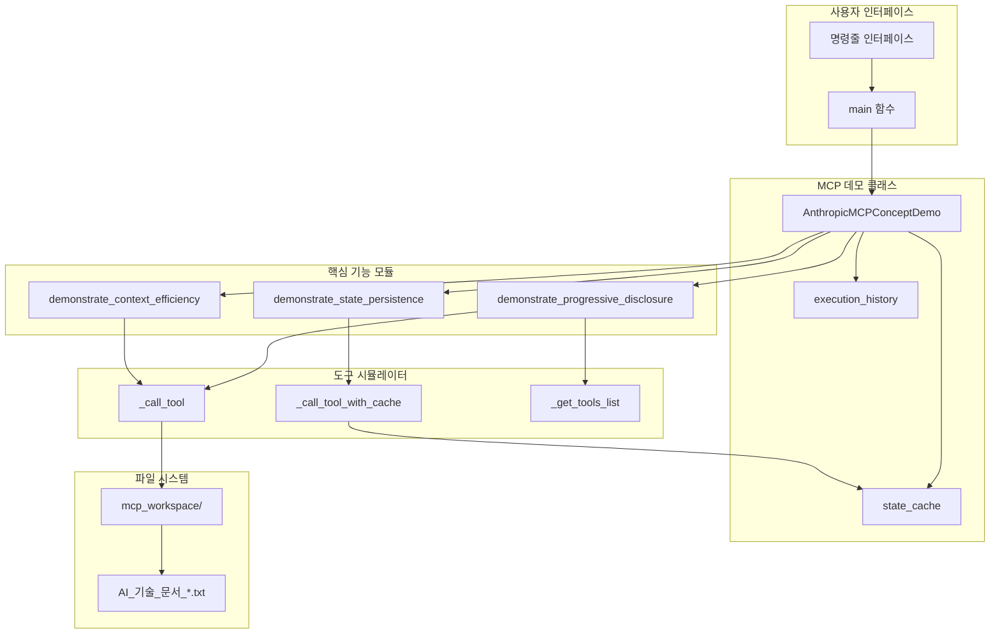
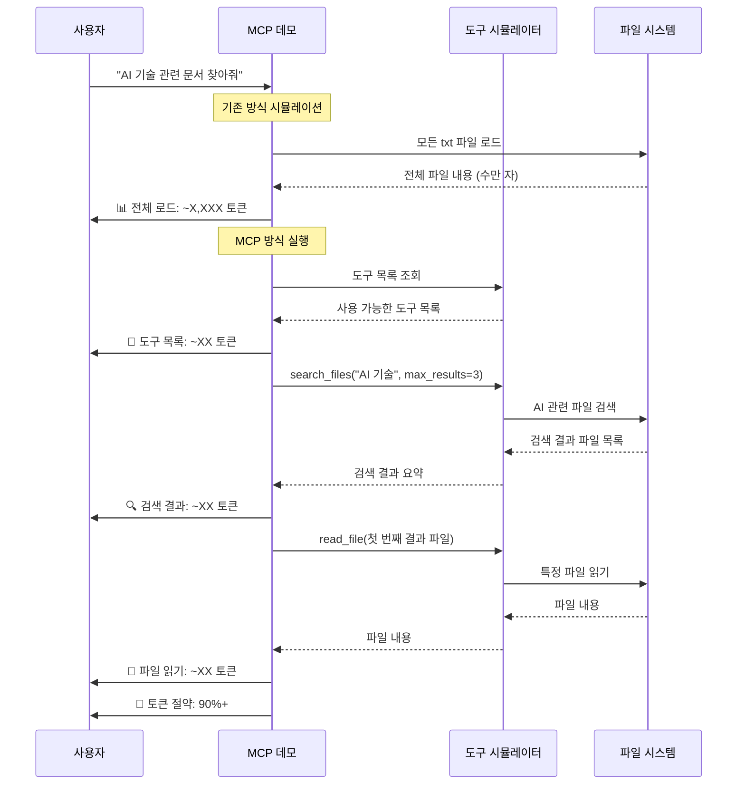
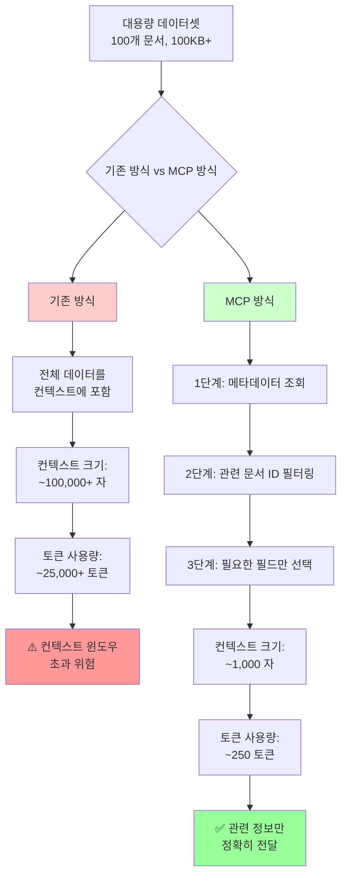
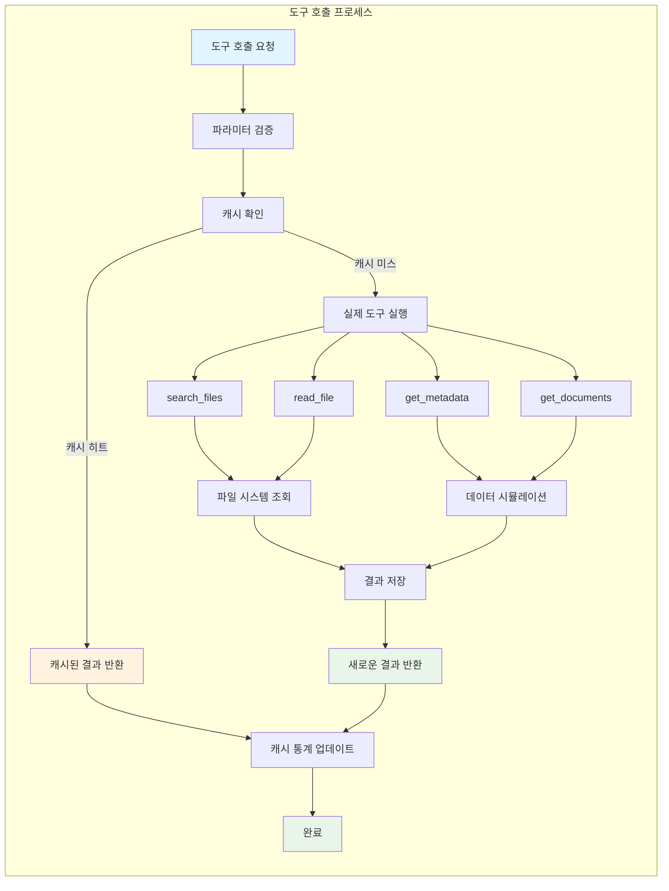
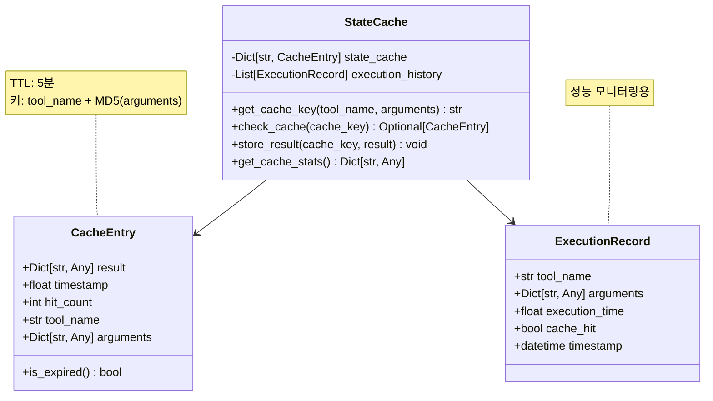

# Anthropic MCP 개념 데모 동작 원리 다이어그램

## 전체 시스템 아키텍처



## 1. 점진적 공개 (Progressive Disclosure) 흐름



## 2. 상태 저장 (State Persistence) 메커니즘

```mermaid
stateDiagram-v2
    [*] --> FirstRequest
    FirstRequest --> GenerateCacheKey: 요청 파라미터로 캐시 키 생성
    GenerateCacheKey --> CheckCache: 캐시 확인
    
    CheckCache --> CacheMiss: 캐시에 없음
    CheckCache --> CacheHit: 캐시에 있음 (5분 내)
    
    CacheMiss --> ExecuteTool: 도구 실제 실행
    ExecuteTool --> StoreResult: 결과를 캐시에 저장
    StoreResult --> ReturnResult: 결과 반환
    ReturnResult --> [*]
    
    CacheHit --> ReturnCached: 캐시된 결과 반환
    ReturnCached --> UpdateHitCount: hit_count 증가
    UpdateHitCount --> [*]
    
    note right of CacheHit: 속도 향상: 10-100배
    note right of ExecuteTool: 첫 실행: O(n) 시간
    note right of ReturnCached: 캐시 히트: O(1) 시간
```

## 3. 컨텍스트 효율성 (Context Efficiency) 필터링



## 4. 도구 호출 시뮬레이션 상세 흐름



## 5. 캐시 데이터 구조



## 6. 성능 비교 메트릭스

```mermaid
gantt
    title MCP vs 기존 방식 성능 비교
    dateFormat X
    axisFormat %s
    
    section 기존 방식
    전체 파일 로드     :0, 3
    전체 데이터 처리    :3, 5
    컨텍스트 구성     :5, 6
    
    section MCP 방식
    도구 목록 조회     :0, 0.5
    필요한 도구만 호출   :0.5, 1.5
    필터링된 결과 처리  :1.5, 2
    컨텍스트 구성     :2, 2.2
    
    section 성능 향상
    토큰 절약율       :milestone, 6, 90%+
    속도 향상         :milestone, 6.2, 2-5배
    컨텍스트 효율     :milestone, 6.4, 95%+ 감소
```



## 핵심 통찰 요약

이 다이어그램들은 Anthropic MCP의 핵심 가치를 시각적으로 보여줍니다:

1. **점진적 공개**: 필요할 때만 도구를 호출하여 불필요한 토큰 소비 방지
2. **상태 저장**: 캐시를 통해 이전 실행 결과를 재사용하여 성능 극대화
3. **컨텍스트 효율성**: 필터링된 데이터만 처리하여 컨텍스트 윈도우 최적화

이러한 원리들을 통해 MCP는 **90% 이상의 토큰 절약**과 **2-100배의 속도 향상**을 달성할 수 있습니다.
